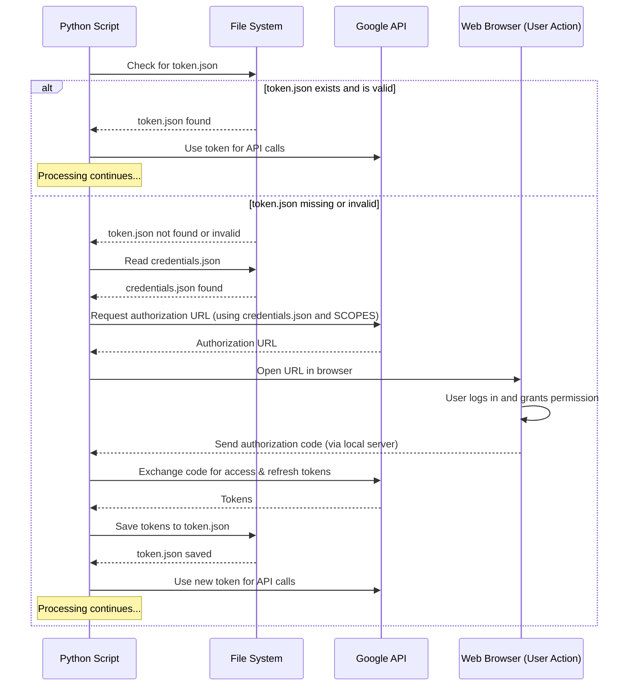

# Chapter 1: Authentication & Credentials

Welcome to the first chapter of the `gmail_spam_handler` tutorial! Before our script can start helping you manage your spam, it needs one crucial thing: permission to access your Gmail account. It's like needing a key or an ID to enter a building. This is where the concept of "Authentication & Credentials" comes in.

Think about it: your Gmail account contains sensitive information. You wouldn't want just any random program on the internet to access it, right? Google has security measures in place to prevent this. Our script needs to prove to Google that *you*, the account owner, have given *this specific script* permission to perform certain actions on *your* account.

This chapter will explain how our script gets that necessary permission using special files, ensuring it can interact with your Gmail safely and with your explicit approval.

## Why Does the Script Need Credentials?

The core task of our project is to interact with your Gmail account – checking for new emails, reading snippets, and moving emails to different folders (like the Spam folder). To do this, the script communicates with Google's services using something called the **Gmail API** (API stands for Application Programming Interface, basically a way for programs to talk to each other).

But talking to the Gmail API requires authorization. It needs to know *who* is asking and *if* they have permission to access the specific account and perform the requested actions.

## The Two Key Files: Your Access Pass

The `gmail_spam_handler` script uses two main files to handle this access:

1.  `credentials.json`
2.  `token.json`

Let's look at each one.

### `credentials.json`: The Script's Identity Card

Imagine `credentials.json` is like the script's official ID card given by Google. It identifies *this specific application* to Google. It contains information like a client ID and a client secret, which Google uses to recognize your project.

**How do you get this file?**

You have to create it yourself through the Google Cloud Console. This ensures that *you* are the one registering this application under *your* Google account. The process involves telling Google you're building an application (in this case, a "Desktop application") that needs to use the Gmail API.

The `README.md` file outlines the steps:

1.  Go to the Google Cloud Console.
2.  Create or select a project.
3.  Enable the **Gmail API** for that project.
4.  Create "OAuth 2.0 client ID" credentials of type "Desktop application".
5.  Download the resulting JSON file and rename it to `credentials.json`.
6.  Place this `credentials.json` file in the same directory as your `gmail_spam_checker.py` script.

This file is **sensitive** because it identifies *your* app project to Google. You should **never share it or commit it to version control** (like Git).

### `token.json`: Your Permission for the Script

While `credentials.json` identifies the *application*, `token.json` holds the proof that *you*, the user, have granted this specific application permission to access your Gmail.

Think of it this way:
*   `credentials.json` = "Hi, I am application #123 registered by User X."
*   `token.json` = "And User Y (that's you!) specifically said application #123 is allowed to modify their Gmail account."

**How is this file created?**

This file is generated the *first time* you run the `gmail_spam_checker.py` script *after* you have placed the `credentials.json` file in the directory.

During this first run:
1.  The script sees it doesn't have a `token.json`.
2.  It uses the `credentials.json` to tell Google, "Hey, application #123 needs permission from the user currently running this script."
3.  Google prompts you in your web browser. You'll be asked to log in to your Google account (if you aren't already) and then asked if you grant permission for the application (identified by the project name you set in the Google Cloud Console) to "modify your Gmail account".
4.  Once you approve, Google sends a special code back to the script.
5.  The script uses this code to get an access token and a refresh token from Google.
6.  These tokens are saved into the `token.json` file.

This `token.json` file is also **very sensitive**. It contains the actual keys that allow the script to access your Gmail without asking you to log in every time. **Never share it or commit it to version control.**

### Scopes: Limiting Permission

When you grant permission via the web browser step, you're not giving the script full access to *everything* in your Google account (like your Google Drive, Calendar, etc.). The application *requests* specific permissions, which are called **scopes**.

In our script, the relevant scope is defined near the top:

```python
SCOPES = ["https://www.googleapis.com/auth/gmail.modify"]
```

This specific scope (`https://www.googleapis.com/auth/gmail.modify`) means the script is only asking for permission to:
*   Read (but not delete) basic email information like headers and snippets.
*   Modify labels on emails (this includes adding/removing labels and moving to spam/inbox).

It does **not** allow the script to read the full content of your emails, send emails on your behalf, or access any other Google service. This is an important security feature – granting the least amount of permission necessary for the job.

## How the Script Uses the Files

The script has a function called `get_credentials()` in `gmail_spam_checker.py` that handles the logic for using these files.

Here's a simplified view of what that function does:

```python
def get_credentials():
    creds = None
    # 1. Check if we already have a token.json file
    if os.path.exists(TOKEN_FILE):
        # If yes, load the credentials from it
        creds = Credentials.from_authorized_user_file(TOKEN_FILE, SCOPES)

    # 2. If we don't have valid credentials (maybe token.json is missing or expired)
    if not creds or not creds.valid:
        if creds and creds.expired and creds.refresh_token:
            # If the token is expired but can be refreshed, try to refresh it
            creds.refresh(Request()) # This talks to Google to get a new token
        if not creds:
            # If no valid creds and couldn't refresh, do the first-run flow
            # This uses credentials.json and opens the browser
            flow = InstalledAppFlow.from_client_secrets_file(CREDENTIALS_FILE, SCOPES)
            creds = flow.run_local_server(port=0)

        # 3. Save the newly obtained/refreshed credentials back to token.json
        with open(TOKEN_FILE, 'w') as token:
            token.write(creds.to_json())

    return creds # Return the valid credentials
```

This function is designed to be smart: it tries to use the existing `token.json` first, refreshes it if needed, and *only* goes through the browser authentication flow if necessary.

Here's a simple diagram showing the process handled by `get_credentials()`:



This diagram illustrates the key steps: prioritizing the saved `token.json` and falling back to the interactive browser flow using `credentials.json` only when needed.

## In Summary

Authentication and Credentials are the foundation of security for our script.
*   `credentials.json` is like the script's ID, identifying it to Google.
*   `token.json` is your explicit permission for that script to access *your* account with limited permissions (defined by `SCOPES`).
*   The `get_credentials()` function handles the logic of using these files, making the process smooth after the initial setup.

These files are private and essential for the script to function securely.

Now that the script knows who it is and has your permission, it's ready to actually talk to Gmail! In the next chapter, we'll explore the [Gmail API Interface](02_gmail_api_interface_.md) and how the script uses it to fetch emails.

[Next Chapter: Gmail API Interface](02_gmail_api_interface_.md)

---

<sub><sup>**References**: [[1]](https://github.com/fancellu/gmail_spam_handler/blob/812aa41305c8d6af0ddee5d83d5790b6a1ee1ec4/README.md), [[2]](https://github.com/fancellu/gmail_spam_handler/blob/812aa41305c8d6af0ddee5d83d5790b6a1ee1ec4/gmail_spam_checker.py)</sup></sub>