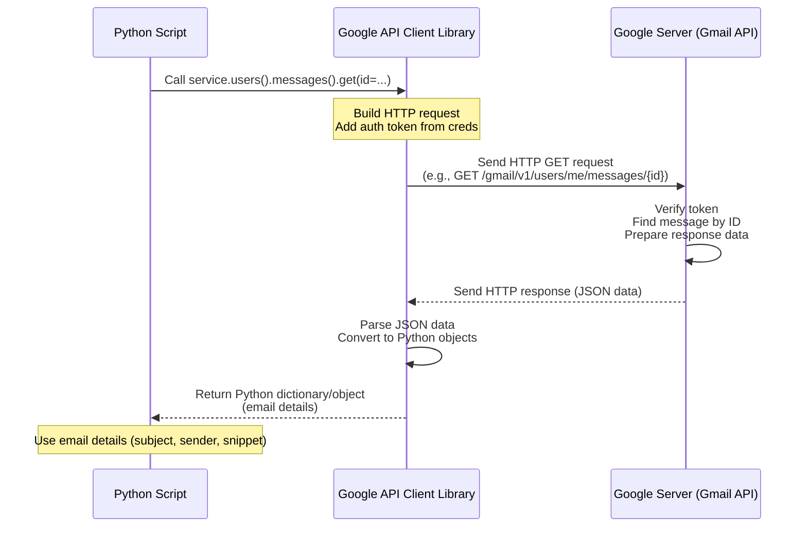

# Chapter 2: Gmail API Interface

Welcome back! In the first chapter, [Authentication & Credentials](01_authentication___credentials_.md), we learned how our script gets the necessary permission (the "key" and "ID") to even *knock* on Google's door and ask about your Gmail.

Now that the script has permission, how does it actually *talk* to Gmail? It needs a way to send commands like "Show me new emails!" or "Tell me about this specific email!" or "Move that email to spam!". This is where the **Gmail API Interface** comes in.

Think of the Gmail API Interface as the **remote control** our script uses to operate your Gmail inbox on Google's servers, without needing you to open a web browser or the Gmail app yourself. It's the part of the script that knows how to translate our desired actions (like "check for unread messages") into the specific technical requests that Google's Gmail service understands.

## What is the Gmail API?

As we briefly mentioned in Chapter 1, API stands for Application Programming Interface. The **Gmail API** is essentially a set of rules and tools that Google provides, allowing other software programs (like our Python script) to interact with Gmail data and functionality in a structured way.

Our script doesn't talk directly to the Gmail servers in a free-form way. It uses this official Gmail API. This ensures security, consistency, and reliability.

## The Gmail API Interface in Our Script: The Remote Control

In our `gmail_spam_checker.py` script, the "Gmail API Interface" isn't a single, separate file. Instead, it's the *way* the script uses a special Python library (called `google-api-python-client`) to communicate with the Gmail API.

The core component of this interface is an object we create that represents the connection to the Gmail service. Let's call it the `service` object, just like it is in the code. This `service` object is our "remote control".

## Getting the Remote Control (`service` object)

To get this "remote control", the script needs two things:

1.  The credentials (the permission obtained in [Authentication & Credentials](01_authentication___credentials_.md)).
2.  The specific Google service we want to interact with (Gmail, version 1).

Look at the `poll_gmail` function in `gmail_spam_checker.py`. After getting the `creds`, the very next important step is creating this `service` object:

```python
# --- Snippet from gmail_spam_checker.py ---
from googleapiclient.discovery import build
# ... other imports and code ...

def poll_gmail(classifier: SpamClassifier):
    creds = get_credentials()
    if not creds:
        logging.error("Could not obtain credentials. Exiting.")
        return

    # This line builds the 'service' object - our remote control!
    service = build('gmail', 'v1', credentials=creds)

    # ... rest of the function ...
```

Here's what's happening:

*   We import the `build` function from `googleapiclient.discovery`.
*   We call `build('gmail', 'v1', credentials=creds)`.
    *   `'gmail'` tells the library we want to talk to the Gmail API.
    *   `'v1'` specifies the version of the Gmail API (different versions might exist as Google updates).
    *   `credentials=creds` provides the necessary permission obtained from [Authentication & Credentials](01_authentication___credentials_.md).

The `build` function does the work of setting up the connection and creating the `service` object, which now has methods (functions) we can call to interact with Gmail.

## Using the Remote Control: Fetching Email Information

Now that we have the `service` object (our remote control), we can use it to send commands to Gmail. A key task for our spam handler is to find new emails and get some basic information about them (subject, sender, a snippet of the body) *before* deciding if they are spam.

Let's see how the `poll_gmail` function uses the `service` object to do this.

First, it asks Gmail for a list of messages that match a specific query:

```python
# --- Snippet from poll_gmail function ---
# ... service object created ...
    processed_label_id = ensure_processed_label(service) # We'll cover this label later

    while True: # The script polls repeatedly
        try:
            # Define what messages we are looking for
            query = f'is:unread -label:{PROCESSED_LABEL_NAME}'
            # Use the service object to list messages matching the query
            response = service.users().messages().list(userId='me', q=query).execute()
            # Get the list of message IDs from the response
            messages = response.get('messages', [])

            # ... rest of the loop ...
```

In this snippet:

*   `service.users().messages().list(...)` is the command we send using the remote control.
    *   `users()`: We are interacting with a user's account.
    *   `messages()`: We are interested in message-related operations.
    *   `list()`: The specific action is to list messages.
*   `userId='me'` tells the API to use the currently authenticated user (that's you!).
*   `q=query` provides a Gmail search query. In this case, we want messages that are `is:unread` and *not* already tagged with our processing label (`-label:ML_PROCESSED`).
*   `.execute()` sends the actual request to Google and waits for the response.

The `response` variable will contain information about the messages found, primarily a list of their unique IDs.

Once we have the list of message IDs, we need to get more details for each one. The script loops through the `messages` list and fetches details for each ID:

```python
# --- Snippet from poll_gmail function (inside the loop) ---
            # ... messages list obtained ...
            if not messages:
                logging.info("No new unread messages. Waiting...")
            else:
                logging.info(f"Found {len(messages)} new message(s) to process.")

            for msg in messages:
                # Get details for the specific message ID
                email = service.users().messages().get(
                    userId='me',
                    id=msg['id'], # Use the ID from the list
                    format='metadata' # Ask for basic details (headers, snippet)
                ).execute()

                # Extract the information we need
                headers = {h['name']: h['value'] for h in email['payload']['headers']}
                subject = headers.get('Subject', '[No Subject]')
                sender = headers.get('From', '[No Sender]')
                snippet = email['snippet']

                # ... processing (trusted sender check, classification) ...
```

Here:

*   `service.users().messages().get(...)` is the command to get details of a *single* message.
    *   `userId='me'` and `id=msg['id']` specify which user and which message.
    *   `format='metadata'` tells the API we only need basic info like headers and the snippet, not the full email body. This is efficient as our script only needs this info for classification.
*   `.execute()` sends the request.

The `email` variable now holds a dictionary containing the requested details, including headers and the snippet, which the script then extracts.

## Using the Remote Control: Modifying Emails

After classifying an email, the script needs to take action – either move it to spam or mark it as processed. The Gmail API Interface is used for this too.

The `modify_message_labels` function is a helper that uses the `service` object to add or remove labels from a message:

```python
# --- Snippet from gmail_spam_checker.py ---
def modify_message_labels(service, msg_id: str, labels_to_add: list, labels_to_remove: list):
    """A generic function to modify labels for a given message."""
    try:
        service.users().messages().modify(
            userId='me',
            id=msg_id, # The ID of the message to modify
            body={'addLabelIds': labels_to_add, 'removeLabelIds': labels_to_remove}
        ).execute()
    except HttpError as e:
        logging.error(f"Failed to modify labels for message {msg_id}: {e}")

# --- Snippet from poll_gmail function (inside the loop) ---
                if spam_probability > SPAM_CONFIDENCE_THRESHOLD:
                    logging.warning(f"SPAM ({spam_probability:.2%}): '{subject}'")
                    # Use the remote control to add 'SPAM' and remove 'INBOX'
                    modify_message_labels(service, email['id'], ['SPAM'], ['INBOX'])
                else:
                    logging.info(f"NOT SPAM ({spam_probability:.2%}): '{subject}'")
                    # Use the remote control to add the processed label
                    modify_message_labels(service, email['id'], [processed_label_id], [])
```

Here:

*   `service.users().messages().modify(...)` is the command to change labels on a message.
    *   `userId='me'` and `id=msg_id` specify the target message.
    *   `body={'addLabelIds': labels_to_add, 'removeLabelIds': labels_to_remove}` tells the API which labels to add (using their IDs) and which to remove. Note that 'SPAM' and 'INBOX' are special built-in Gmail label IDs. We'll talk about our custom processed label ID in the next chapter, [Processed Label](03_processed_label_.md).
*   `.execute()` sends the request.

This is how the script actually moves the email to the Spam folder (by adding the 'SPAM' label and removing 'INBOX') or marks it as processed (by adding our custom label).

## How it Works Under the Hood (Simplified)

When our script uses the `service` object to make a call like `service.users().messages().get(...).execute()`, here's a very simplified view of what happens:



The `google-api-python-client` library (`GoogleAPIClient` in the diagram) acts as a helpful translator and messenger. Our script tells the library *what* it wants (`users().messages().get`), the library figures out the exact web address (URL) and format needed for the request, includes the authentication token, sends it to Google, waits for the reply, and finally gives the data back to our script in an easy-to-use Python format.

## Key API Interface Actions in Our Script

Here's a summary of the main ways our script uses the Gmail API Interface (the `service` object):

| What the Script Wants to Do       | Gmail API Call                                        | Code Snippet Example (Simplified)                                        |
| :-------------------------------- | :---------------------------------------------------- | :----------------------------------------------------------------------- |
| Set up the connection             | `build('gmail', 'v1', credentials=creds)`             | `service = build(...)`                                                   |
| Check if a custom label exists    | `service.users().labels().list(userId='me')`          | `service.users().labels().list(...).execute()`                           |
| Create a custom label             | `service.users().labels().create(userId='me', body=...)` | `service.users().labels().create(...).execute()`                         |
| Find messages matching a query    | `service.users().messages().list(userId='me', q=...)` | `service.users().messages().list(...).execute()`                         |
| Get specific details of a message | `service.users().messages().get(userId='me', id=..., format=...)` | `service.users().messages().get(...).execute()`                          |
| Add/Remove labels from a message  | `service.users().messages().modify(userId='me', id=..., body=...)` | `service.users().messages().modify(...).execute()`                       |

These calls are the core commands our "remote control" sends to manage your Gmail inbox according to the script's logic.

## In Summary

The Gmail API Interface, primarily represented by the `service` object created using `build('gmail', 'v1', credentials=creds)`, is the mechanism that allows our script to communicate with your Gmail account.

*   It uses the permission obtained from [Authentication & Credentials](01_authentication___credentials_.md).
*   It translates Python code calls into technical requests understood by Google's Gmail API.
*   It allows the script to list emails, fetch their details (subject, sender, snippet), and modify their labels (including moving to Spam).

Now that the script can authenticate and talk to Gmail, we need a way to keep track of which emails it has already checked. This is crucial to avoid processing the same email over and over. In the next chapter, we'll look at the concept of the [Processed Label](03_processed_label_.md).

[Next Chapter: Processed Label](03_processed_label_.md)

---

<sub><sup>**References**: [[1]](https://github.com/fancellu/gmail_spam_handler/blob/812aa41305c8d6af0ddee5d83d5790b6a1ee1ec4/gmail_spam_checker.py)</sup></sub>