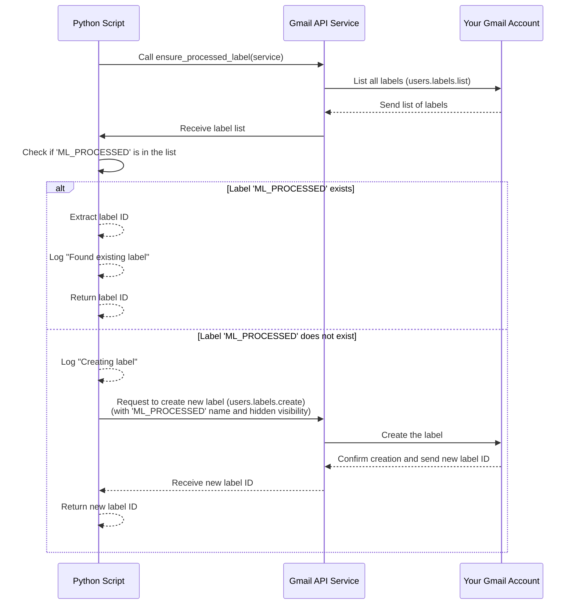

# Chapter 3: Processed Label

Welcome back! In the previous chapter, [Gmail API Interface](02_gmail_api_interface_.md), we learned how our script uses the "remote control" (the `service` object) to talk to your Gmail account – fetching email details and changing labels.

Now, imagine your inbox has hundreds or even thousands of emails. If our script simply checked *all* unread emails every minute, it would quickly get overwhelmed and repeatedly process the same messages. That's inefficient and wastes your API quota.

We need a way for the script to know: "Okay, I've looked at this email already. I don't need to check it again next time." This is the problem the **Processed Label** solves.

## The Problem: Repeating Work

Let's say the script runs, finds a new email, checks it, and decides it's not spam. Great! But the next minute, when the script runs again, that same email is still unread. The script would find it *again*, classify it *again*, and decide it's not spam *again*. This repetition is wasteful.

## The Solution: An Invisible Stamp

To avoid this, our script uses a special, custom label in your Gmail account as a marker. Think of it like putting a little invisible stamp on each email as soon as the script has finished analyzing it. This stamp tells the script, "I've been processed!"

This special marker is called the **Processed Label**. In our script, its default name is `ML_PROCESSED`, as defined by the `PROCESSED_LABEL_NAME` constant.

```python
# --- Snippet from gmail_spam_checker.py ---
PROCESSED_LABEL_NAME = 'ML_PROCESSED' # The name of the label used to mark emails
```

This label isn't like your usual labels (Inbox, Sent, Spam) or labels you create for organizing emails (Work, Personal, Receipts). The script is designed to keep this label hidden from your view in Gmail, so it doesn't clutter your inbox interface. Its sole purpose is for the script's internal tracking.

## Ensuring the Label Exists

Since this is a custom label, it won't exist in your Gmail account the very first time you run the script. The script needs to check if the label is there and, if not, create it using the [Gmail API Interface](02_gmail_api_interface_.md).

The `ensure_processed_label` function in `gmail_spam_checker.py` handles this.

Here's a high-level look at its logic:

1.  Ask Gmail for a list of all existing labels in your account.
2.  Go through that list and see if a label with the name `ML_PROCESSED` (or whatever `PROCESSED_LABEL_NAME` is set to) exists.
3.  If it exists, remember its unique ID (Gmail uses IDs internally, not just names).
4.  If it *doesn't* exist, tell Gmail to create a new label with that name and configured to be hidden.
5.  Remember the ID of the newly created label.
6.  Return the label's ID so the script can use it later.

Let's look at the core parts of the `ensure_processed_label` function:

```python
# --- Snippet from gmail_spam_checker.py ---
def ensure_processed_label(service) -> str | None:
    """Checks if the 'processed' label exists and creates it if not."""
    try:
        # 1. List all labels in the account
        labels_response = service.users().labels().list(userId='me').execute()

        # 2. Check if our specific label exists
        for label in labels_response.get('labels', []):
            if label['name'] == PROCESSED_LABEL_NAME:
                logging.info(f"Found existing label: '{PROCESSED_LABEL_NAME}'")
                return label['id'] # Found it, return its ID

        # 3. If not found, create it
        logging.info(f"Creating label: '{PROCESSED_LABEL_NAME}'")
        label_body = {
            'name': PROCESSED_LABEL_NAME,
            'labelListVisibility': 'labelHide', # Hide from the label list in Gmail
            'messageListVisibility': 'hide' # Hide on individual messages in Gmail
        }
        created_label = service.users().labels().create(userId='me', body=label_body).execute()
        return created_label['id'] # Return the new label's ID

    except HttpError as e:
        logging.error(f"Failed to ensure label exists: {e}")
        return None
```

This function is called once at the beginning of the `poll_gmail` loop. It uses the `service` object (our Gmail remote control from Chapter 2) to interact with the Gmail API's `labels()` functionality. It tries to `list()` labels first and then `create()` one if the desired label name isn't found. The `labelListVisibility` and `messageListVisibility` settings ensure the label stays out of your way in the Gmail interface.

Here's a simple flow diagram for `ensure_processed_label`:



The `ensure_processed_label` function guarantees that by the time the main processing loop starts, the script has the unique ID for the `ML_PROCESSED` label, whether it found an existing one or created a new one.

## Using the Label: Marking Emails

Once an email has been processed (meaning the script has fetched its details, checked for trusted senders, and run the spam classifier), we need to apply that "invisible stamp" – the processed label.

This is done using the `modify_message_labels` function, which we briefly saw in Chapter 2. After the spam classification (or the trusted sender check) is complete, the script calls this function to add the processed label to the email.

Look at these lines within the `poll_gmail` loop, after the classification logic:

```python
# --- Snippet from poll_gmail function (inside the message loop) ---
            for msg in messages:
                # ... fetch email details (subject, sender, snippet) ...

                if any(domain in sender.lower() for domain in TRUSTED_DOMAINS):
                    logging.info(f"TRUSTED: '{subject}' from {sender}")
                    # If trusted, mark as processed and skip classification
                    modify_message_labels(service, email['id'], [processed_label_id], [])
                    continue # Move to the next message

                # ... classification happens here ...
                # spam_probability = classifier.get_spam_probability(...)

                if spam_probability > SPAM_CONFIDENCE_THRESHOLD:
                    logging.warning(f"SPAM ({spam_probability:.2%}): '{subject}'")
                    # If spam, move to SPAM folder (adds 'SPAM', removes 'INBOX')
                    modify_message_labels(service, email['id'], ['SPAM'], ['INBOX'])
                else:
                    logging.info(f"NOT SPAM ({spam_probability:.2%}): '{subject}'")
                    # If NOT spam, just mark as processed
                    modify_message_labels(service, email['id'], [processed_label_id], [])

```

Notice the two places where `modify_message_labels` is called with `[processed_label_id]` in the `labels_to_add` list:

1.  If the email is from a [Trusted Sender](05_trusted_senders_list_.md).
2.  If the email is classified as *not* spam.

In both these cases, the email is considered "dealt with" by the script. The `modify_message_labels` function uses the [Gmail API Interface](02_gmail_api_interface_.md) to tell Gmail: "For this specific email ID, please add the label with this ID (`processed_label_id`)."

## How This Prevents Re-processing

The final piece is how the script uses this label to *avoid* checking the same email again. Remember the `query` used to find messages in the `poll_gmail` loop?

```python
# --- Snippet from poll_gmail function ---
            query = f'is:unread -label:{PROCESSED_LABEL_NAME}'
            response = service.users().messages().list(userId='me', q=query).execute()
            messages = response.get('messages', [])
```

This query is asking Gmail for messages that are:
*   `is:unread`: They haven't been opened.
*   `-label:{PROCESSED_LABEL_NAME}`: They *do not* have the `ML_PROCESSED` label.

Because the script adds the `ML_PROCESSED` label to every email it analyzes (unless it moves it to Spam, which also changes its status), the very next time the loop runs, that email will no longer match the query `is:unread -label:ML_PROCESSED`. It *will* have the `ML_PROCESSED` label, so it is excluded from the results.

This simple query, combined with the act of applying the processed label, is the core mechanism for preventing the script from repeatedly checking the same emails.

## Benefits of the Processed Label

*   **Efficiency:** The script only fetches details and classifies emails that are new *and* haven't been seen by the script before.
*   **Accuracy:** Prevents potential issues with re-classifying the same email.
*   **API Usage:** Reduces the number of API calls needed, helping to stay within Google's usage limits.
*   **Clarity:** Provides a clear marker (for the script, not for you) of which emails have gone through the analysis pipeline.

## In Summary

The Processed Label is a clever but simple technique used by the script to keep track of which emails it has already analyzed.

*   It's a custom label (default name `ML_PROCESSED`) created and managed by the script.
*   The script ensures the label exists using the [Gmail API Interface](02_gmail_api_interface_.md) via the `ensure_processed_label` function.
*   After processing an email (either classifying it or identifying it as a [Trusted Sender](05_trusted_senters_list_.md) and not spam), the script adds the processed label using `modify_message_labels`.
*   The main query (`is:unread -label:ML_PROCESSED`) then excludes these already-processed emails from future checks.

This mechanism is fundamental to the script's efficiency, ensuring it only focuses on genuinely new emails each time it polls your inbox.

Now that we know how the script finds messages and keeps track of which ones it's seen, the next logical step is to understand the core logic of *how* it decides if an email is spam. In the next chapter, we'll dive into the [Spam Classifier](04_spam_classifier_.md).

[Next Chapter: Spam Classifier](04_spam_classifier_.md)

---

<sub><sup>**References**: [[1]](https://github.com/fancellu/gmail_spam_handler/blob/812aa41305c8d6af0ddee5d83d5790b6a1ee1ec4/README.md), [[2]](https://github.com/fancellu/gmail_spam_handler/blob/812aa41305c8d6af0ddee5d83d5790b6a1ee1ec4/gmail_spam_checker.py)</sup></sub>