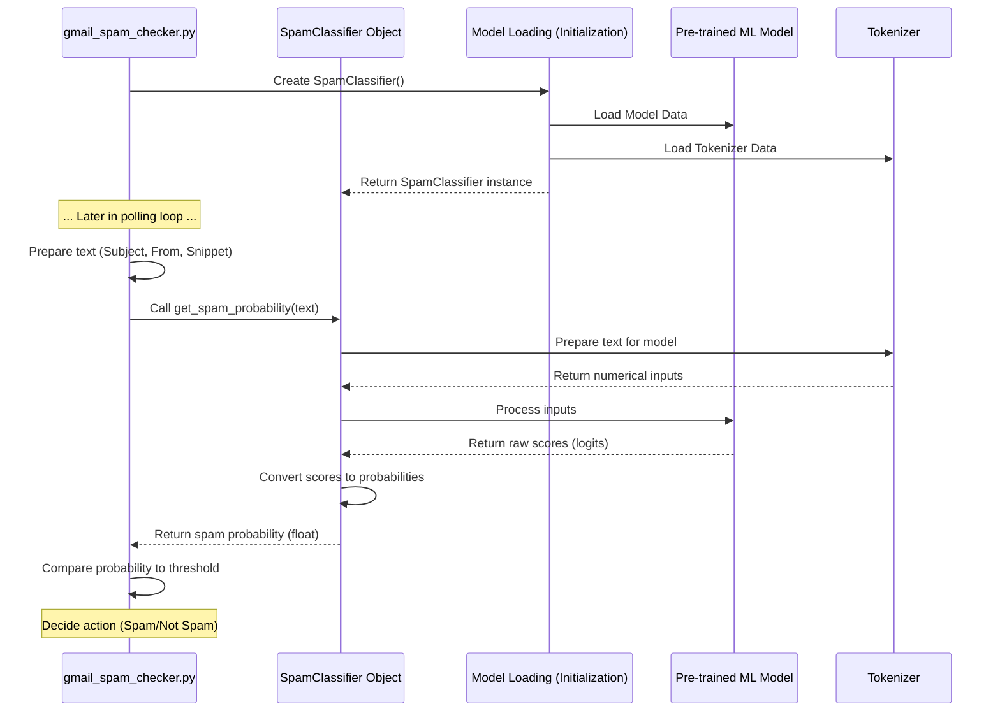

# Chapter 4: Spam Classifier

Welcome back! In our journey so far, we've equipped the `gmail_spam_handler` script with essential tools:

*   In [Chapter 1: Authentication & Credentials](01_authentication___credentials_.md), it got the "keys" to securely access your Gmail account.
*   In [Chapter 2: Gmail API Interface](02_gmail_api_interface_.md), it learned how to use those keys with a "remote control" (`service` object) to talk to Google's Gmail service – fetching emails and changing labels.
*   In [Chapter 3: Processed Label](03_processed_label_.md), it gained a way to "stamp" emails it has already checked, so it doesn't waste time looking at them again.

Now, the script can find new emails and interact with them, but it's missing the most crucial part: the ability to decide *whether* an email is spam. How does it make that decision?

This is the role of the **Spam Classifier**. Think of this component as the "brain" or the "expert reviewer" of the script. It's responsible for analyzing the actual content of an email and giving it a "spam confidence score".

## The Problem: Identifying Spam

You receive emails every day. Some are legitimate messages from friends, family, or services you use. Others are unwanted solicitations, scams, or junk – spam! You know the difference when you read them, but how can a computer program tell?

Spammers are constantly changing their tactics. Simple rules (like "if it contains the word 'Viagra'") aren't enough anymore. We need a more intelligent way to look at the email's characteristics and learn to spot the patterns of spam.

## The Solution: A Machine Learning Expert

Our script uses a sophisticated approach: a pre-trained **machine learning model**. You don't need to be an expert in machine learning to use this script! The hard work of training the model has already been done by someone else.

The **Spam Classifier** is the part of our script that knows how to communicate with this pre-trained model. It takes pieces of the email (like the subject, sender, and a snippet of the body) and feeds them to the model. The model then processes this text and outputs a number, typically a probability score between 0.0 and 1.0, indicating how likely it thinks the email is spam.

*   A score close to 0.0 means "Very unlikely to be spam."
*   A score close to 1.0 means "Very likely to be spam."

Based on this score, our script can then decide whether to move the email to the Spam folder.

## Using the Spam Classifier

The core logic for the Spam Classifier is contained in the `spam_classifier.py` file, but the main script (`gmail_spam_checker.py`) is what uses it.

Let's see how the `gmail_spam_checker.py` script uses the classifier.

First, when the script starts, it creates an instance of the `SpamClassifier`:

```python
# --- Snippet from the end of gmail_spam_checker.py ---
if __name__ == "__main__":
    os.environ['TF_ENABLE_ONEDNN_OPTS'] = '0'

    # Create our SpamClassifier object
    spam_classifier = SpamClassifier()

    # Pass the classifier to the main polling loop
    poll_gmail(spam_classifier)
```

This line `spam_classifier = SpamClassifier()` is like hiring our "expert reviewer" and getting them ready to work.

Then, inside the main `poll_gmail` loop, after fetching an email's details (subject, sender, snippet) using the [Gmail API Interface](02_gmail_api_interface_.md), the script prepares the text and asks the classifier for its opinion:

```python
# --- Snippet from poll_gmail function in gmail_spam_checker.py ---
            for msg in messages:
                # ... fetch email details (subject, sender, snippet) ...

                # ... trusted sender check happens here ...

                # Prepare the text for the classifier
                text_to_classify = f"Subject: {subject} From: {sender} Body: {snippet}"

                # Ask the classifier for the spam probability!
                spam_probability = classifier.get_spam_probability(text_to_classify)

                # Now, make a decision based on the probability
                if spam_probability > SPAM_CONFIDENCE_THRESHOLD:
                    logging.warning(f"SPAM ({spam_probability:.2%}): '{subject}'")
                    # ... move to spam ...
                else:
                    logging.info(f"NOT SPAM ({spam_probability:.2%}): '{subject}'")
                    # ... mark as processed ...
```

Here's what's happening:

1.  `text_to_classify = f"Subject: {subject} From: {sender} Body: {snippet}"`: The script combines the most relevant parts of the email into a single string. This is the text the classifier will analyze.
2.  `spam_probability = classifier.get_spam_probability(text_to_classify)`: This is the key step! The script calls the `get_spam_probability` method on the `spam_classifier` object, passing it the combined text. This is like handing the "expert reviewer" the email summary and asking, "What do you think?".
3.  `if spam_probability > SPAM_CONFIDENCE_THRESHOLD:`: The `get_spam_probability` method returns a number (the probability). The script then compares this number to a configuration setting called `SPAM_CONFIDENCE_THRESHOLD`. This threshold determines how confident the classifier must be that an email is spam before the script takes action. By default, this is set to `0.95` (95%), meaning the classifier must be very confident.

So, the `SpamClassifier`'s main job is to provide that crucial `spam_probability` number based on the email text.

## Inside the Spam Classifier (`spam_classifier.py`)

Let's peek inside the `spam_classifier.py` file to understand how it works without getting lost in machine learning jargon.

The `SpamClassifier` class is essentially a container for the machine learning model and the tools needed to use it.

### Initialization (`__init__`)

When `SpamClassifier()` is created, the `__init__` method runs:

```python
# --- Snippet from spam_classifier.py ---
from transformers import AutoTokenizer, AutoModelForSequenceClassification
import torch
# ... other imports and logging ...

DEFAULT_MODEL_NAME = "mariagrandury/roberta-base-finetuned-sms-spam-detection"

class SpamClassifier:
    def __init__(self, model_name: str = DEFAULT_MODEL_NAME):
        self.model_name = model_name
        # Determine if we can use a fast GPU (cuda) or slower CPU
        self.device = torch.device('cuda' if torch.cuda.is_available() else 'cpu')
        logging.info(f"SpamClassifier using device: {self.device}")

        try:
            # Load the tokenizer (prepares text for the model)
            self.tokenizer = AutoTokenizer.from_pretrained(self.model_name)
            # Load the actual machine learning model
            self.model = AutoModelForSequenceClassification.from_pretrained(self.model_name)
            # Move the model to the chosen device (CPU/GPU)
            self.model.to(self.device)
            # Set the model to evaluation mode
            self.model.eval()
        except Exception as e:
            logging.error(f"Failed to load model '{self.model_name}'. Error: {e}")
            raise
```

*   It sets up where the computations will run (`self.device`) – ideally a GPU (`cuda`) if available, otherwise the CPU.
*   It uses the `transformers` library (from Hugging Face) to load two main things:
    *   `AutoTokenizer`: This tool knows how to break down the email text into pieces (tokens) that the specific machine learning model understands.
    *   `AutoModelForSequenceClassification`: This is the actual pre-trained machine learning model. `from_pretrained(self.model_name)` tells the library to download (if not already cached) and load the model specified by `DEFAULT_MODEL_NAME`. This model is specifically trained to classify text into categories (like spam vs. not spam).
*   It moves the loaded model to the chosen device and sets it to evaluation mode (`.eval()`), which is necessary before making predictions.

This `__init__` method essentially loads all the necessary components for the "expert reviewer" (the model and its tokenizer) and gets them ready. This loading only happens once when the script starts.

### Getting the Probability (`get_spam_probability`)

The `get_spam_probability` method is the one called by the main script:

```python
# --- Snippet from spam_classifier.py ---
    def get_spam_probability(self, text: str) -> float:
        """
        Calculates the spam probability for a single piece of text.
        """
        # Calls the batch version for efficiency, even for a single text
        return self.get_spam_probabilities_batch([text])[0]

    def get_spam_probabilities_batch(self, texts: List[str]) -> List[float]:
        """
        Calculates spam probabilities for a batch of texts (more efficient).
        """
        try:
            # Use the tokenizer to prepare the text(s)
            inputs = self.tokenizer(
                texts, # The text or list of texts
                return_tensors="pt", # Return PyTorch tensors
                truncation=True,     # Shorten if too long
                padding=True,        # Add padding if too short
                max_length=512       # Maximum length of text
            )
            # Move the prepared input data to the chosen device
            inputs = {k: v.to(self.device) for k, v in inputs.items()}

            # Feed the prepared data into the model
            with torch.no_grad(): # Don't calculate gradients (saves memory/speed during prediction)
                outputs = self.model(**inputs)

            # The model outputs 'logits', convert these to probabilities
            predictions = torch.nn.functional.softmax(outputs.logits, dim=-1)

            # The model is trained for two classes (0: not spam, 1: spam)
            # We want the probability for class 1 (spam)
            spam_probabilities = predictions[:, 1].tolist()
            return spam_probabilities # Return the list of probabilities

        except Exception as e:
            logging.error(f"Error during classification: {e}")
            return [0.0] * len(texts) # Return 0 probability in case of error
```

The `get_spam_probability` method for a single text simply calls `get_spam_probabilities_batch`, because models are often more efficient at processing multiple items at once (even if it's just one).

The `get_spam_probabilities_batch` method does the core work:

1.  **Tokenize:** `self.tokenizer(...)` takes the input text(s) and converts them into numerical representations that the model can understand. It also handles details like cutting off text that's too long (`truncation`) and adding blank space to shorter texts (`padding`) so they all have the same length, which is needed by the model.
2.  **Move to Device:** The numerical input data is moved to the correct device (CPU or GPU) where the model is located.
3.  **Model Inference:** `outputs = self.model(**inputs)` is where the magic happens. The prepared input data is fed into the machine learning model. The model performs complex calculations based on what it learned during training. The `with torch.no_grad():` part just tells the system we only want the prediction, not the information needed for training, which makes it faster and uses less memory.
4.  **Get Probabilities:** The model's raw output (`outputs.logits`) is a set of scores (one for "not spam", one for "spam"). `torch.nn.functional.softmax(...)` converts these scores into probabilities that add up to 1.0.
5.  **Return Spam Probability:** We know the model is trained such that the second probability (index `1`) corresponds to "spam". `predictions[:, 1].tolist()` extracts this spam probability for each input text and returns it as a standard Python list.

This process, from taking raw text to outputting a spam probability, is what the `SpamClassifier` encapsulates.

Here's a simplified sequence of how the main script uses the classifier:



## The Spam Confidence Threshold

The `SPAM_CONFIDENCE_THRESHOLD` is a simple but important setting.

```python
# --- Snippet from gmail_spam_checker.py ---
SPAM_CONFIDENCE_THRESHOLD = 0.95 # The probability score required to mark an email as spam
```

This number (defaulting to 0.95) is the line in the sand. If the classifier returns a spam probability *greater than* 0.95, the script concludes it's spam. If the probability is *less than or equal to* 0.95, the script concludes it's not spam (according to the classifier).

You can adjust this value in the `gmail_spam_checker.py` file.

*   A **lower** threshold (e.g., 0.80) would catch *more* potential spam, but might also incorrectly flag more legitimate emails as spam (more "false positives").
*   A **higher** threshold (e.g., 0.99) would be *more cautious*, only marking emails as spam if the model is extremely confident. This reduces false positives but might miss some spam (more "false negatives").

Finding the right threshold is often a personal preference based on how aggressive you want the script to be versus how cautious.

## In Summary

The Spam Classifier is the intelligence behind the script's spam detection.

*   It's implemented in the `spam_classifier.py` file as the `SpamClassifier` class.
*   It uses a pre-trained machine learning model from Hugging Face to analyze email text (subject, sender, snippet).
*   Its main method, `get_spam_probability`, takes text and returns a number between 0.0 and 1.0 indicating the probability of it being spam.
*   The main script (`gmail_spam_checker.py`) calls this method and compares the resulting probability to the `SPAM_CONFIDENCE_THRESHOLD` to decide whether to move the email to the Spam folder or mark it as processed using the [Processed Label](03_processed_label_.md).

This chapter explained the core decision-making process. However, machine learning models aren't perfect, and sometimes you might have senders you *always* trust, regardless of what their emails look like. In the next chapter, we'll explore how the script handles these cases with the [Trusted Senders List](05_trusted_senders_list_.md).

[Next Chapter: Trusted Senders List](05_trusted_senders_list_.md)

---

<sub><sup><sub><sup><sub></sub> <sub><sup>**References**: [[1]](https://github.com/fancellu/gmail_spam_handler/blob/812aa41305c8d6af0ddee5d83d5790b6a1ee1ec4/README.md), [[2]](https://github.com/fancellu/gmail_spam_handler/blob/812aa41305c8d6af0ddee5d83d5790b6a1ee1ec4/gmail_spam_checker.py), [[3]](https://github.com/fancellu/gmail_spam_handler/blob/812aa41305c8d6af0ddee5d83d5790b6a1ee1ec4/spam_classifier.py)</sup></sub>