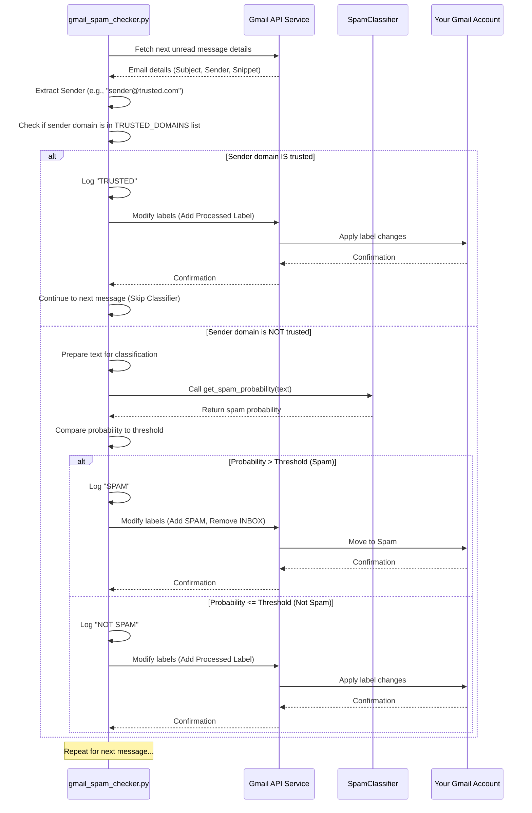

# Chapter 5: Trusted Senders List

Welcome back! In the previous chapter, [Spam Classifier](04_spam_classifier_.md), we learned how our script uses a machine learning "expert" to analyze email text and decide if it's likely spam. This is powerful, but machine learning models, while smart, aren't perfect 100% of the time.

Sometimes, you might receive an email from a sender you absolutely trust – perhaps your bank, your workplace, or a close friend – but the email's content might be unusual (maybe it's just a very short reply, or contains strange characters for some reason). Even a very good classifier might assign a low probability of being legitimate to such an email, potentially flagging it as spam.

This is where the concept of a **Trusted Senders List** comes in. We need a way to tell the script: "Look, if an email comes from *anyone* at `@thiscompany.com` or `@myfriendsdomain.net`, I don't care *what* the email says, I know it's not spam. Just let it through!"

## The Problem: Overriding the Classifier for Known Good Senders

Relying *only* on the spam classifier is great for catching unknown or obvious spam, but it lacks the human context of knowing which senders you explicitly trust. You wouldn't want an important alert from your bank going into the spam folder just because the email format confused the classifier.

## The Solution: A "VIP List" of Domains

The Trusted Senders List is a simple, predefined list of email sender domains that your script considers automatically legitimate. It's like a VIP list at the entrance of a club: if you're on the list, you get waved right in, bypassing the security checks (the spam classifier).

In our `gmail_spam_handler` script, this list is controlled by a configuration setting. Any email arriving from a sender whose email address ends with one of the domains in this list will completely skip the machine learning classification step. These emails are simply marked as processed and left untouched in your inbox, just like a legitimate email that passed the classifier.

## How to Use the Trusted Senders List

The Trusted Senders List is implemented as a simple Python list of strings right at the top of your `gmail_spam_checker.py` file.

Look for the `TRUSTED_DOMAINS` constant:

```python
# --- Snippet from gmail_spam_checker.py ---
# ... other constants ...

TRUSTED_DOMAINS = [
    '@google.com', '@gmail.com', '@github.com', '@microsoft.com', '@amazon.com'
]

# ... rest of the code ...
```

By default, it contains a few common domains.

To use this feature, you simply **edit this list** to add or remove the domains you explicitly trust.

*   **Adding a domain:** If you always trust emails from `@yourcompany.com`, you would add that string to the list. Make sure to include the `@` symbol.
*   **Removing a domain:** If you no longer want to automatically trust emails from a specific domain, remove it from the list.

**Example:**

Let's say you want to add `@yourbank.com` and `@yourfriend.net` to the list. You would change the `TRUSTED_DOMAINS` line to look something like this:

```python
# --- Example: How to add trusted domains ---
TRUSTED_DOMAINS = [
    '@google.com',
    '@gmail.com',
    '@github.com',
    '@microsoft.com',
    '@amazon.com',
    '@yourbank.com',   # <--- Added your bank
    '@yourfriend.net'  # <--- Added your friend's domain
]
```

After saving the `gmail_spam_checker.py` file with your changes, the script will use your updated list the next time it runs.

## How the Script Uses the Trusted Senders List (Under the Hood)

The logic for the Trusted Senders List is implemented in the main `poll_gmail` function, *before* the script calls the [Spam Classifier](04_spam_classifier_.md).

Here's the simple flow:

1.  The script fetches the details of an unread email using the [Gmail API Interface](02_gmail_api_interface_.md).
2.  It extracts the sender's email address (the "From" header).
3.  It checks if the sender's email address ends with *any* of the domains listed in `TRUSTED_DOMAINS`.
4.  **If it finds a match:** The email is immediately considered legitimate. The script skips the entire spam classification step and proceeds directly to marking the email as processed using the [Processed Label](03_processed_label_.md).
5.  **If it does NOT find a match:** The script proceeds to the next step, which is calling the [Spam Classifier](04_spam_classifier_.md) to get a probability score.

Here's the snippet from `poll_gmail` showing this check:

```python
# --- Snippet from poll_gmail function in gmail_spam_checker.py ---
            for msg in messages:
                email = service.users().messages().get(userId='me', id=msg['id'], format='metadata').execute()

                headers = {h['name']: h['value'] for h in email['payload']['headers']}
                subject = headers.get('Subject', '[No Subject]')
                sender = headers.get('From', '[No Sender]') # Get the sender's info

                # --- Check if the sender is in the TRUSTED_DOMAINS list ---
                # .lower() converts sender to lowercase for case-insensitive check
                # any(...) checks if ANY domain in TRUSTED_DOMAINS is found in the sender string
                if any(domain in sender.lower() for domain in TRUSTED_DOMAINS):
                    logging.info(f"TRUSTED: '{subject}' from {sender}")
                    # If trusted, add the processed label and SKIP the classifier
                    modify_message_labels(service, email['id'], [processed_label_id], [])
                    continue # Go to the next message immediately
                # --- End of Trusted Senders check ---

                # If not trusted, PROCEED to classification:
                text_to_classify = f"Subject: {subject} From: {sender} Body: {snippet}"
                spam_probability = classifier.get_spam_probability(text_to_classify)

                # ... rest of classification logic ...
```

Let's break down the key check line:

```python
if any(domain in sender.lower() for domain in TRUSTED_DOMAINS):
```

*   `sender.lower()`: This converts the sender's email address (e.g., `"Alice <alice@example.com>"`) to lowercase (e.g., `"alice <alice@example.com>"`). This makes the check case-insensitive, so `@Example.com` and `@example.com` are treated the same.
*   `for domain in TRUSTED_DOMAINS`: This loops through each item in your `TRUSTED_DOMAINS` list (e.g., `@google.com`, `@yourbank.com`).
*   `domain in sender.lower()`: For each `domain`, this checks if that string is found *anywhere* within the lowercase `sender` string. Using `@domain` helps ensure it matches the domain part of the email address.
*   `any(...)`: This function returns `True` if the check (`domain in sender.lower()`) is `True` for *at least one* of the domains in the `TRUSTED_DOMAINS` list. If none of the domains are found in the sender string, `any()` returns `False`.

So, the `if` statement is true if the sender's address contains any of the strings you listed in `TRUSTED_DOMAINS`.

If the condition is true (`any` returns `True`), the code inside the `if` block runs:

```python
                    logging.info(f"TRUSTED: '{subject}' from {sender}")
                    # If trusted, add the processed label and SKIP the classifier
                    modify_message_labels(service, email['id'], [processed_label_id], [])
                    continue # Go to the next message immediately
```

*   It logs that the email was identified as trusted.
*   It calls `modify_message_labels` (which we saw in [Chapter 3: Processed Label](03_processed_label_.md)) to add the `processed_label_id` to the email. This marks the email as handled by the script.
*   `continue` is a Python keyword that tells the loop to stop processing the *current* message immediately and move on to the *next* message in the `messages` list. This is how it skips the classification step.

Here's a simple sequence diagram showing the flow for a single message with the trusted sender check:



This diagram clearly shows how the trusted sender check provides a faster path, completely bypassing the classifier for emails from known good sources.

## Benefits of the Trusted Senders List

*   **Reliability:** Guarantees that emails from your most important contacts or services will never be marked as spam by the classifier.
*   **Speed:** Bypassing the classifier means the script processes emails from trusted senders faster.
*   **Efficiency:** Saves the computational resources and API calls that would have been used to run the classifier on these emails.

It's a simple but effective way to add your personal knowledge about safe senders into the automated process.

## In Summary

The Trusted Senders List provides a simple mechanism to automatically mark emails from specific domains as legitimate, completely skipping the machine learning spam classification.

*   You control this list by editing the `TRUSTED_DOMAINS` variable in `gmail_spam_checker.py`.
*   The script checks the sender's domain against this list *before* calling the classifier.
*   If a match is found, the email is immediately marked with the [Processed Label](03_processed_label_.md), and the script moves to the next email.
*   This ensures emails from trusted sources are always handled correctly and efficiently.

With the Trusted Senders List in place, our script now has two main ways to decide an email isn't spam: either it's on the trusted list, or the classifier says it's not spam. The script is now equipped with all the individual pieces of logic. How does it tie this all together and keep checking for new emails over time? That's handled by the main loop, which we'll explore in the next chapter, the [Gmail Polling Loop](06_gmail_polling_loop_.md).

[Next Chapter: Gmail Polling Loop](06_gmail_polling_loop_.md)

---

<sub><sup>**References**: [[1]](https://github.com/fancellu/gmail_spam_handler/blob/812aa41305c8d6af0ddee5d83d5790b6a1ee1ec4/README.md), [[2]](https://github.com/fancellu/gmail_spam_handler/blob/812aa41305c8d6af0ddee5d83d5790b6a1ee1ec4/gmail_spam_checker.py)</sup></sub>