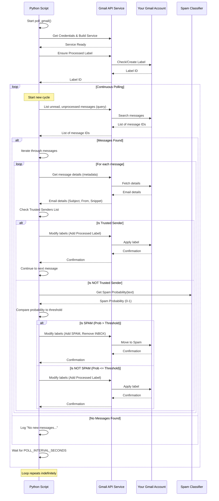

# Chapter 6: Gmail Polling Loop

Welcome to the final concept chapter of the `gmail_spam_handler` tutorial! We've built up all the necessary pieces:

*   We learned how the script gets permission to access your Gmail ([Chapter 1: Authentication & Credentials](01_authentication___credentials_.md)).
*   We saw how it talks to Gmail using the "remote control" provided by the Gmail API ([Chapter 2: Gmail API Interface](02_gmail_api_interface_.md)).
*   We understood how it uses a hidden label to remember which emails it has already processed ([Chapter 3: Processed Label](03_processed_label_.md)).
*   We explored the "brain" that decides if an email is spam using a machine learning model ([Chapter 4: Spam Classifier](04_spam_classifier_.md)).
*   And we added a way to automatically trust specific senders, bypassing the classifier ([Chapter 5: Trusted Senders List](05_trusted_senders_list_.md)).

Now, how do all these pieces work together continuously to monitor your inbox? You don't want to run the script once and then forget about it. You want it to *keep checking* for new emails as they arrive throughout the day.

This is the job of the **Gmail Polling Loop**. It's the main engine that keeps the script running, repeatedly checking your Gmail account, processing new messages, and then pausing before checking again.

## The Problem: Constantly Monitoring Your Inbox

Emails arrive at any time. To effectively handle spam as it lands in your inbox, the script needs to be like a watchful guard, always on duty. It needs a mechanism to:

1.  Check for new messages.
2.  Process any messages it finds.
3.  Wait a bit.
4.  Go back to step 1 and check again.

This cycle needs to repeat indefinitely.

## The Solution: A Never-Ending Cycle (Almost!)

The **Gmail Polling Loop** is the part of the script that implements this continuous cycle. It uses a fundamental programming construct: a `while True` loop.

Think of it as hiring a dedicated assistant for your inbox. This assistant has a checklist:

1.  "Peek into the inbox: Are there any new, unprocessed emails?"
2.  "If yes, process each one according to the rules (Is it a trusted sender? Is it spam?). Stamp it as processed."
3.  "If no new emails (or finished processing the ones found), take a short break (like 60 seconds)."
4.  "Okay, break's over. Go back to step 1!"

This assistant keeps repeating this checklist forever, ensuring your inbox is regularly checked.

In our script, the `poll_gmail` function contains this main loop.

## Inside the `poll_gmail` Function: The Main Loop

Let's look at the structure of the `poll_gmail` function in `gmail_spam_checker.py`:

```python
# --- Snippet from gmail_spam_checker.py ---
def poll_gmail(classifier: SpamClassifier):
    # --- Setup steps (run once at the start) ---
    creds = get_credentials() # Get authentication credentials (Chapter 1)
    if not creds: # If we can't authenticate, stop
        logging.error("Could not obtain credentials. Exiting.")
        return

    service = build('gmail', 'v1', credentials=creds) # Build the API service object (Chapter 2)
    processed_label_id = ensure_processed_label(service) # Ensure the processed label exists (Chapter 3)
    if not processed_label_id: # If we can't get/create the label, stop
        logging.error("Could not obtain or create a processing label. Exiting.")
        return
    # --- End of Setup ---

    # --- The main Polling Loop starts here! ---
    while True:
        try:
            # Step 1: Check for new messages
            # Step 2: Process messages if found
            # Step 3: Handle errors
            pass # Placeholder for the actual loop body

        # Step 4: Catch any errors that occurred
        except HttpError as e:
            logging.error(f"An API error occurred: {e}")
        except Exception as e:
            logging.error(f"An unexpected error occurred: {e}", exc_info=True)

        # Step 5: Wait before the next check
        time.sleep(POLL_INTERVAL_SECONDS)

    # The loop continues forever until the script is manually stopped
```

We've added comments (`# Step X: ...`) to highlight the main parts of the loop structure. Let's break down the actual code inside the `while True` block.

### Step 1: Checking for New Messages

Inside the `while True` loop, the first crucial action is asking Gmail for new emails. We use the [Gmail API Interface](02_gmail_api_interface_.md) for this, and crucially, we use the `query` to filter messages based on their read status and the [Processed Label](03_processed_label_.md):

```python
# --- Snippet from poll_gmail function (inside the while True loop) ---
            query = f'is:unread -label:{PROCESSED_LABEL_NAME}'
            response = service.users().messages().list(userId='me', q=query).execute()
            messages = response.get('messages', [])

            if not messages:
                logging.info("No new unread messages. Waiting...")
            else:
                logging.info(f"Found {len(messages)} new message(s) to process.")

            # ... rest of the loop body ...
```

*   `query = f'is:unread -label:{PROCESSED_LABEL_NAME}'`: This creates the search query string. It means "find all messages that are currently unread (`is:unread`) AND do *not* have the label specified by `PROCESSED_LABEL_NAME` (`-label:...`)". This is how the script ensures it only looks at emails that are both new *to you* and new *to the script's processing*.
*   `service.users().messages().list(...)`: This uses the [Gmail API Interface](02_gmail_api_interface_.md) (`service` object) to send the query to Gmail.
*   `messages = response.get('messages', [])`: The response from Gmail contains a list of message IDs that match the query. This line extracts that list.
*   The `if not messages:` block simply checks if the list is empty. If it is, the script logs a message and proceeds to the waiting step.

This part of the loop is the "Peek into the inbox" action of our assistant.

### Step 2: Processing Found Messages

If the `messages` list is *not* empty, the script needs to process each message it found. It does this using a `for` loop:

```python
# --- Snippet from poll_gmail function (inside the while True loop) ---
            # ... messages list obtained ...

            for msg in messages:
                # --- Process a single message ---
                # Fetch details (Chapter 2)
                email = service.users().messages().get(userId='me', id=msg['id'], format='metadata').execute()
                headers = {h['name']: h['value'] for h in email['payload']['headers']}
                subject = headers.get('Subject', '[No Subject]')
                sender = headers.get('From', '[No Sender]')
                snippet = email['snippet']

                # Check Trusted Senders (Chapter 5)
                if any(domain in sender.lower() for domain in TRUSTED_DOMAINS):
                    logging.info(f"TRUSTED: '{subject}' from {sender}")
                    # Mark as processed (Chapter 3)
                    modify_message_labels(service, email['id'], [processed_label_id], [])
                    continue # Skip the rest of the processing for this message

                # Classify as Spam (Chapter 4)
                text_to_classify = f"Subject: {subject} From: {sender} Body: {snippet}"
                spam_probability = classifier.get_spam_probability(text_to_classify)

                # Take Action based on Classification (Chapter 2, 3)
                if spam_probability > SPAM_CONFIDENCE_THRESHOLD:
                    logging.warning(f"SPAM ({spam_probability:.2%}): '{subject}'")
                    # Move to Spam folder (removes INBOX, adds SPAM)
                    modify_message_labels(service, email['id'], ['SPAM'], ['INBOX'])
                else:
                    logging.info(f"NOT SPAM ({spam_probability:.2%}): '{subject}'")
                    # Mark as processed (adds ML_PROCESSED label)
                    modify_message_labels(service, email['id'], [processed_label_id], [])
                # --- End of processing for a single message ---

            # ... waiting step comes after this loop finishes ...
```

This `for msg in messages:` loop is where all the core logic from the previous chapters is applied *to each individual email* found in the check.

*   It fetches the email's details.
*   It performs the [Trusted Senders List](05_trusted_senders_list_.md) check. If it matches, it applies the [Processed Label](03_processed_label_.md) and uses `continue` to skip to the next message.
*   If not trusted, it uses the [Spam Classifier](04_spam_classifier_.md) to get a probability.
*   Based on the probability and the `SPAM_CONFIDENCE_THRESHOLD`, it uses the [Gmail API Interface](02_gmail_api_interface_.md) (`modify_message_labels`) to either move the email to Spam or apply the [Processed Label](03_processed_label_.md).

This loop ensures that every new, unprocessed email is handled by your defined rules.

### Step 3: Handling Errors

The entire block of code that checks for messages and processes them is wrapped in a `try...except` block:

```python
# --- Snippet from poll_gmail function (inside the while True loop) ---
    while True:
        try:
            # ... Check for new messages ...
            # ... Process messages if found ...

        except HttpError as e:
            logging.error(f"An API error occurred: {e}")
        except Exception as e:
            logging.error(f"An unexpected error occurred: {e}", exc_info=True)

        # ... waiting step ...
```

This is important for a script that runs continuously. If there's a temporary problem (like a network issue, a glitch with the Gmail API, or some unexpected data in an email), the `try...except` block catches the error, logs it, and *prevents the script from crashing*. After logging the error, the script continues to the waiting step (`time.sleep`) and will attempt the cycle again, hoping the problem was temporary.

### Step 4: Waiting

After checking for messages (whether it found any or not, and whether it processed them or encountered an error), the loop includes a pause:

```python
# --- Snippet from poll_gmail function (inside the while True loop) ---
        # ... try...except block ...

        time.sleep(POLL_INTERVAL_SECONDS)
```

*   `time.sleep(POLL_INTERVAL_SECONDS)`: This line tells the script to pause execution for a number of seconds defined by the `POLL_INTERVAL_SECONDS` constant.

This pause is crucial. Without it, the script would repeatedly hit the Gmail API as fast as possible, which is inefficient, unnecessary, and could potentially exceed Google's usage limits. The pause gives the script a break and waits for a reasonable amount of time for new emails to potentially arrive.

The `POLL_INTERVAL_SECONDS` constant is defined near the top of the `gmail_spam_checker.py` file:

```python
# --- Snippet from gmail_spam_checker.py ---
# ... other constants ...
POLL_INTERVAL_SECONDS = 60 # How long to wait between checks (in seconds)
# ... rest of the code ...
```

By default, this is set to 60 seconds (1 minute). You can change this value to check more or less frequently. A shorter interval means faster processing of new spam, but more frequent API calls. A longer interval reduces API calls but means spam might sit in your inbox a bit longer before being moved. 60 seconds is usually a good balance for personal use.

### Step 5: Repeat!

After the `time.sleep` finishes, the `while True` loop automatically jumps back to the beginning of the `try` block to start the cycle all over again: check, process, wait, repeat!

## The Full Polling Cycle (Simplified Flow)

Here's a simplified sequence diagram showing the continuous cycle of the `poll_gmail` function:



This diagram illustrates the core `while True` loop, showing how it repeatedly queries Gmail, processes any messages found (using the Trusted Sender check and Classifier), takes action via the API Service, and then pauses before starting the next check.

## Running the Polling Loop

To start this continuous polling process, you simply run the `gmail_spam_checker.py` script.

```bash
python gmail_spam_checker.py
```

The script will perform the initial setup (getting credentials, ensuring the label exists) and then enter the `while True` loop in `poll_gmail`. It will keep running until you manually stop it (e.g., by pressing `Ctrl+C` in the terminal).

As it runs, it will print log messages to your console indicating when it checks for messages, when it finds new ones, and what action it takes (Trusted, Not Spam, or SPAM).

## In Summary

The Gmail Polling Loop, powered by a `while True` loop in the `poll_gmail` function, is the core mechanism that keeps the `gmail_spam_handler` script alive and actively monitoring your inbox.

*   It runs continuously after the initial setup is complete.
*   In each cycle, it queries Gmail for unread emails that haven't been processed by the script before (`is:unread -label:ML_PROCESSED`).
*   If messages are found, it processes each one using the [Trusted Senders List](05_trusted_senders_list_.md) and the [Spam Classifier](04_spam_classifier_.md).
*   It uses the [Gmail API Interface](02_gmail_api_interface_.md) to apply labels, either moving the email to Spam or marking it with the [Processed Label](03_processed_label_.md).
*   After processing (or if no messages were found), it pauses for a duration defined by `POLL_INTERVAL_SECONDS` before starting the next check.
*   `try...except` blocks ensure that temporary errors don't crash the script.

This continuous cycle allows the script to automatically handle incoming spam and trust your designated senders, providing a hands-free way to manage your inbox.

This concludes the concept chapters for the `gmail_spam_handler` project. You now understand the main components that work together: authentication, API communication, tracking processed emails, classifying spam, handling trusted senders, and the main loop that orchestrates it all.

To use the script, you would follow the setup steps in the `README.md` (getting credentials, installing dependencies) and then simply run the `gmail_spam_checker.py` file. The polling loop takes care of the rest!

---

<sub><sup>**References**: [[1]](https://github.com/fancellu/gmail_spam_handler/blob/812aa41305c8d6af0ddee5d83d5790b6a1ee1ec4/gmail_spam_checker.py)</sup></sub>