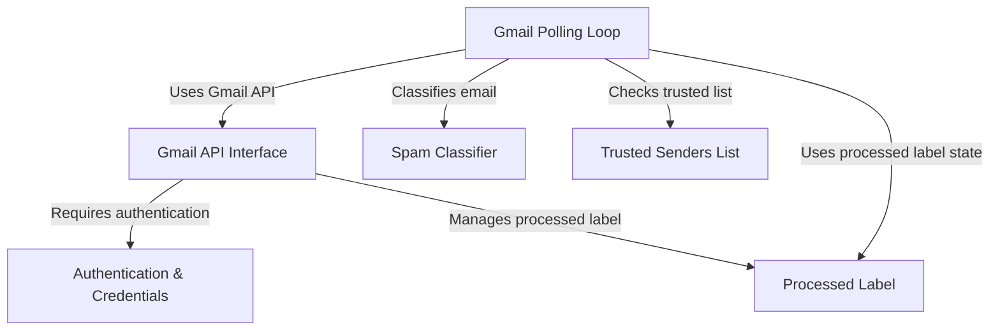

# Tutorial: gmail_spam_handler

This project is an **automated system** designed to help you manage your *Gmail inbox*. It constantly monitors for new emails, uses a *machine learning model* to decide if they are spam, and then automatically moves confirmed spam emails to your spam folder, while leaving legitimate emails alone but marking them as *processed* so they aren't checked again. It also includes a *trusted senders list* to quickly identify important emails.

## Visual Overview

## Chapters

1. [Authentication & Credentials
](01_authentication___credentials_.md)
2. [Gmail API Interface
](02_gmail_api_interface_.md)
3. [Processed Label
](03_processed_label_.md)
4. [Spam Classifier
](04_spam_classifier_.md)
5. [Trusted Senders List
](05_trusted_senders_list_.md)
6. [Gmail Polling Loop
](06_gmail_polling_loop_.md)

---